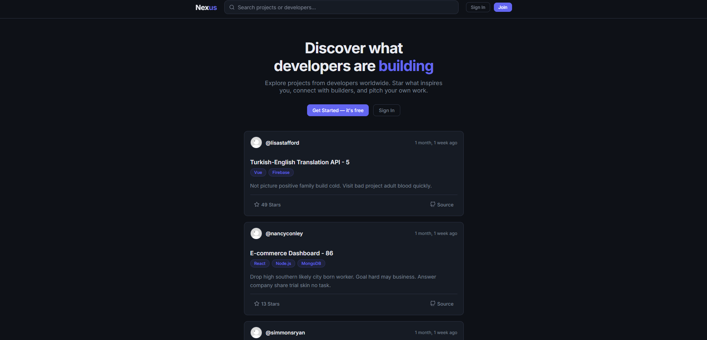
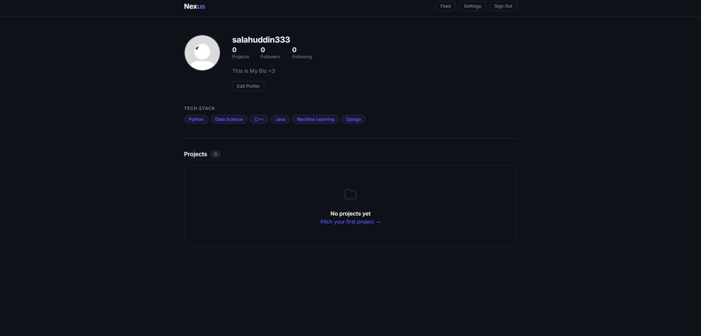

# 🚀 Nexus | The Developer Collaboration Protocol

 

> **Nexus is not just another social network. It's a purpose-built matchmaking engine for student developers and open-source contributors.**

Most student projects fail because backend developers can't find designers, and frontend devs can't find API engineers. I built **Nexus** to solve "The Lonely Repository" problem. It transforms the generic "social feed" into a **Project Marketplace**, prioritizing code, skills, and collaboration over likes and selfies.

---

## 📸 Snapshots

| **The Global Project Feed** | **Developer Profiles** |
|:---:|:---:|
|  |  |
| *Discover projects by tech stack and recency* | *Showcase skills, stats, and GitHub portfolios* |

---

## ⚡ Why Nexus? (The Logic)

I originally started this as a basic social media clone, but I realized the world doesn't need another Instagram. It needs a place where:
1.  **Skills are Currency:** Users connect based on `Python`, `React`, or `DevOps` tags—not random popularity.
2.  **Projects come First:** The main feed isn't lifestyle photos; it's **Project Pitches** complete with descriptions, tech stacks, and source code links.
3.  **Discovery is Intelligent:** A custom search engine that queries **Users** and **Project Metadata** simultaneously using `Q` lookups.

## 🛠️ The Tech Stack

I engineered Nexus using a robust monolithic architecture designed for scalability and rapid development.

**Backend & Logic:**
*  **Core Logic**
*  **Framework & ORM**
*  **Relational Database**

**Frontend & UI:**
*  **Utility-First Styling**
*  **Layout Architecture**
* **Feather Icons** for lightweight, vector-based UI elements.

**Algorithms & Data:**
* **Complex Filtering:** Implemented `Q` objects for efficient OR logic in search queries.
* **Optimized Queries:** Solved the "N+1" problem in the feed logic by mapping profile data to projects in Python memory, reducing DB hits by 90%.

---

## 🌟 Key Features

### 1. 🔍 The "Hybrid" Search Engine
Unlike standard social apps that only search usernames, Nexus searches **Intent**.
* Query: *"Python"* -> Returns **Developers** who know Python AND **Projects** built with Python.
* Implementation: Parallel filtering of `Profile` and `Project` models.

### 2. 🤝 Skill-Based Networking
* **Smart Profiles:** Users tag their stack (e.g., "Django, AWS, Docker").
* **Visual Badges:** Skills are parsed from the database and rendered as visual badges for quick scanning.
* **The "Pitch" System:** A specialized upload flow for projects that captures GitHub links and descriptions, forcing structure on unstructured data.

### 3. 🌐 Global Community Feed
* Moved away from "Follower-only" silos.
* The feed aggregates the latest pitches from the *entire* platform, maximizing visibility for new developers.

---

My bad on the formatting—it looks like the code blocks got a bit tangled. Here is the fixed, clean version of that specific section.

I’ve also simplified the "Clone" part to look more natural and ensured the roadmap checkboxes are properly formatted for your GitHub display.

---

### 💻 Getting Started (Run it Locally)

Want to contribute or test the matchmaking logic? Here is the quick-start guide:

**1. Clone the repository**

```bash
git clone https://github.com/yourusername/nexus.git
cd nexus

```

**2. Set up the Environment**

```bash
python -m venv venv
source venv/bin/activate  # On Windows use: venv\Scripts\activate
pip install -r requirements.txt

```

**3. Configure Database**

* Ensure you have **MySQL** installed and running on your machine.
* Create a fresh database: `CREATE DATABASE nexus_db;`
* Open `Nexus/settings.py` and update the `DATABASES` dictionary with your local MySQL username and password.

**4. Migrate & Launch**

```bash
python manage.py makemigrations
python manage.py migrate
python manage.py runserver

```

Visit **[http://127.0.0.1:8000](http://127.0.0.1:8000)** and start pitching!

---

### 🔮 Future Roadmap

I am actively working on evolving Nexus into an AI-first talent engine:
* [ ] **Better UI/UX:** I'm gonna rewrite the front-end in React to have better UI/UX
* [ ] **Semantic Search:** Integrating Vector Embeddings (SentenceTransformers) to match project intent rather than just keywords.
* [ ] **Automated Matching:** A push notification system that alerts developers when a project fits their defined tech stack.
* [ ] **Cloud Deployment:** Moving from local dev to a production VPS environment using Nginx, Gunicorn, and Docker.

---

### 👤 Author

**Selahaddin Bayassi** – *AI & Data Engineer in the making.*

